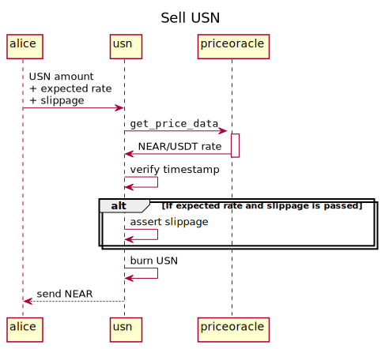

[](https://github.com/binary-star-near/usn)

# USN

USN is a NEAR-native USD stable coin.

The contract implements fungible token API according to the following standards:
1. [NEP-141](https://nomicon.io/Standards/FungibleToken/Core) (ERC-20 fashioned)
2. [NEP-148](https://nomicon.io/Standards/FungibleToken/Metadata)
3. [Fungible Token Event](https://nomicon.io/Standards/FungibleToken/Event)

The specific part of the USN contract is `buy`/`sell` methods of NEAR/USD exchange with rates taken from the oracle ([priceoracle](https://github.com/NearDeFi/price-oracle/)).

# Contract Address

| Mainnet  | Testnet      |
|----------|--------------|
| usn      | usdn.testnet |

# How It Works

## Buy USN for NEAR
*Method:* `buy`


## Sell USN for NEAR with `sell` API
*Method:* `sell`



## Slippage

Methods `buy` and `sell` requires the _expected_ exchange rate to avoid slippage. If the price suddenly changes (slips) out of the expected deviation the USN contract aborts the transaction.

# Build

First, install prerequisites:
```bash
npm install
```
Then, build.

For local sandbox:
```bash
npm run build
```

For testnet:
```bash
npm run build:testnet
```

For mainnet:
```bash
npm run build:mainnet
```
**WARNING**: There is a difference in each target. The crucial difference is that they communicate with different oracle addresses:
* Mainnet: `priceoracle.near`
* Testnet: `priceoracle.testnet`
* Sandbox: `priceoracle.test.near`

And all these oracle contracts report prices with different asset names.

# Test
## Run unit tests
```bash
cargo test
```

## Run integration tests
```bash
npm run build
npm run deploy
npm run test
```

## Manual testing on the Testnet
Build
```bash
npm run build:testnet
```
Deploy
```bash
near deploy --force --wasmFile target/wasm32-unknown-unknown/testnet/usn.wasm --accountId=usdn.testnet --masterAccount=usdn.testnet
```
Init once
```bash
near call usdn.testnet new --args '{"owner_id": "usdn.testnet"}' --accountId=usdn.testnet
```

Add a guardian

```bash
near call usdn.testnet extend_guardians --accountId usdn.testnet --args '{"guardians": ["alice.testnet"]}'
```

Buy and sell

```bash
# Send NEAR, buy USN.
near call usdn.testnet buy --accountId alice.testnet --amount 1 --gas 50000000000000

# Check USN balance.
near call usdn.testnet ft_balance_of --accountId alice.testnet --args '{"account_id": "alice.testnet"}'

# Sell USN, receive NEAR.
near call usdn.testnet sell --accountId alice.testnet --args '{"amount": "118800"}' --gas 50000000000000

# Buy USN with slippage control
 near call usdn.testnet buy  --args '{"expected": {"multiplier": "111439", "slippage": "10", "decimals": "28" }}' --accountId alice.testnet --amount 1 --gas 50000000000000

# Buy USN and transfer to someone.
near call usdn.testnet buy --args '{"to": "bob.testnet"}' --accountId alice.testnet --amount 1 --gas 50000000000000
```

# DAO
## Upgrade the contract via Upgrade Proposal
1. Download `usn.mainnet.wasm` from https://github.com/binary-star-near/usn/releases
2. Create an upgrade proposal:
   ```bash
   sputnikdao proposal upgrade usn.mainnet.wasm usn --daoAcc usn --accountId alice.near --network mainnet
   ```