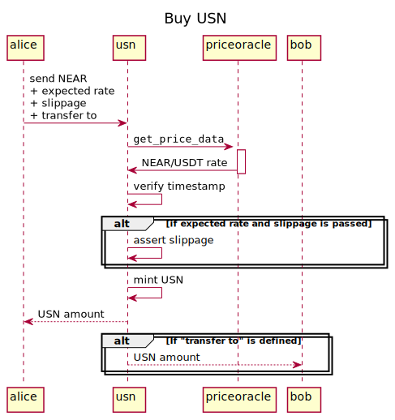

[](https://github.com/binary-star-near/usn)

# USN

USN is a NEAR-native USD stable coin.

The contract implements fungible token API according to the following standards:
1. [NEP-141](https://nomicon.io/Standards/FungibleToken/Core) (ERC-20 fashioned)
2. [NEP-148](https://nomicon.io/Standards/FungibleToken/Metadata)
3. [Fungible Token Event](https://nomicon.io/Standards/FungibleToken/Event)

The specific part of the USN contract is `buy`/`sell` methods of NEAR/USD exchange with rates taken from the oracle (`priceoracle`).

## Contract Address

| Mainnet  | Testnet  |
|----------|----------|
| usn      | -        |

## How It Works

### Buy USN for NEAR
*Method:* `buy`



### Sell USN for NEAR with `sell` API
*Method:* `sell`


### Cache

The cache stores the exchange rate from the [priceoracle](https://github.com/NearDeFi/price-oracle/) to avoid cross-contract calls for a period of time when the price is still valid. Cross-contract calls are very expensive for users. The cache is valid during the reported recency duration interval, it allows to make 0 cross-contract calls for a while (up to 50 seconds).

### Slippage

Methods `buy` and `sell` requires the _expected_ exchange rate to avoid slippage. If the price suddenly changes (slips) out of the expected deviation the USN contract aborts the transaction.


## Test
### Add a Guardian

Guardians can be added and removed by owner.
```rust
pub fn extend_guardians(&mut self, guardians: Vec<AccountId>);
pub fn remove_guardians(&mut self, guardians: Vec<AccountId>);
```
Example:
```bash
near call usn.binary-star.near extend_guardians --accountId binary-star.near --args '{"guardians": ["alice.near"]}'
```

### Buy and Sell

USN token provides in-built _currency exchange_ API: `buy` and `sell`.

```rust
#[payable]
pub fn buy(&mut self) -> Balance;
pub fn sell(&mut self, amount: U128) -> Balance;
```
Example of usage with NEAR CLI:

```bash
# Register an account in the USN contract.
near call usn.testnet storage_deposit '' --accountId alice.testnet --amount 0.00125

# Send NEAR, buy USN.
near call usn.testnet buy --accountId alice.testnet --amount 0.01

# Check the USN balance.
near call usn.testnet ft_balance_of --accountId alice.testnet --args '{"account_id": "alice.testnet"}'

# Sell USN, receive NEAR.
near call usn.testnet sell --accountId alice.testnet --args '{"amount": "118800"}'
```

## Build

Add Rust `wasm32` target:
```bash
rustup target add wasm32-unknown-unknown
```
Build the contract:

```bash
cargo build --target wasm32-unknown-unknown --release
```

```bash
cargo test
```

## Deploy

### On `sandbox`:

Install sandbox:

```bash
npm install -g near-sandbox
near-sandbox --home /tmp/near-sandbox init
near-sandbox --home /tmp/near-sandbox run
```

Deploy:

```bash
$ near deploy --wasmFile target/wasm32-unknown-unknown/release/usn.wasm --initFunction new_default_meta --initArgs '{"owner_id": "test.near", "1000000000000000000"}' --accountId test.near --networkId sandbox --nodeUrl http://0.0.0.0:3030 --keyPath /tmp/near-sandbox/validator_key.json
```

### On `mainnet`:

```bash
$ near deploy --wasmFile target/wasm32-unknown-unknown/release/usn.wasm --initFunction new_default_meta --initArgs '{"owner_id": "usn.near", "1000000000000000000"}' --accountId=usn.near --networkId=mainnet --nodeUrl=https://rpc.mainnet.near.org

```
